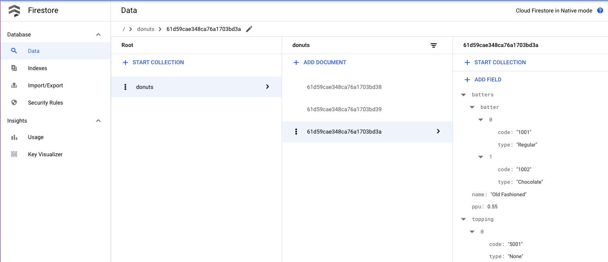

# Migrating Collections from MongoDB to Cloud Firestore

## Introduction

Cloud Firestore is a flexible, scalable and cloud-hosted NoSQL database for mobile, web, and server development from Google Cloud. Cloud Firestore also offers seamless integration with other Firebase and Google Cloud products, including Cloud Functions. Firestore stores data as documents organized into collections. With Cloud Firestore you get automatic multi-region data replication, strong consistency guarantees, atomic batch operations, and real transaction support. Developers choose Firestore for client applications needing data on the fly and automatically synced between client applications using realtime listeners.

This article explains how to migrate collections from MongoDB to Firestore in 3 easy steps. If you want to try these steps the sample files are provided in this repository.

## Prerequisites

1. MongoDB database where your source data to be migrated resides
2. Mongo Shell to interact with MongoDB
3. Install [Mongo database tools](https://docs.mongodb.com/database-tools/installation/installation-linux/) specifically you will need mongoexport
4. Install [jq](https://stedolan.github.io/jq/) to process JSON data
5. Install nodejs and [firestore-export-import](https://www.npmjs.com/package/firestore-export-import) npm package
6. Target Cloud Firestore to import data to. Add a Firebase Service Account and get the service account key as explained [here](https://firebase.google.com/docs/admin/setup#initialize-sdk). This key is a JSON file with the following data that includes your private key so that you can talk to the Firestore DB.

```
{
  "type": "",
  "project_id": "",
  "private_key_id": "",
  "private_key": "",
  "client_email": "",
  "client_id": "",
  "auth_uri": "",
  "token_uri": "",
  "auth_provider_x509_cert_url": "",
  "client_x509_cert_url": ""
}
```

## How does the migration work?

We will understand this with an example. 

Let us say you store the [a JSON](./donuts.json) as a `donuts` collection in a MongoDB.

```
[
	{
		"type": "donut",
		"name": "Cake",
		"ppu": 0.55,
		"batters":
			{
				"batter":
					[
						{ "code": "1001", "type": "Regular" },
						{ "code": "1002", "type": "Chocolate" },
						{ "code": "1003", "type": "Blueberry" },
						{ "code": "1004", "type": "Devil's Food" }
					]
			},
		"topping":
			[
				{ "code": "5001", "type": "None" },
				{ "code": "5002", "type": "Glazed" },
				{ "code": "5005", "type": "Sugar", "unhealthy": true  },
				{ "code": "5007", "type": "Powdered Sugar", "unhealthy": true },
				{ "code": "5006", "type": "Chocolate with Sprinkles" },
				{ "code": "5003", "type": "Chocolate" },
				{ "code": "5004", "type": "Maple" }
			]
	},
...
]
```

**NOTE:** You can add this data to your MongoDB as a `donuts` collection if you want to try this yourself `mongoimport --uri $MONGODB_URI --collection donuts --type json donuts.json --jsonArray`

MongoDB stores this data by assigning an ObjectId for each object in the collection as below

```
> db.donuts.find();
{ "_id" : ObjectId("61d59cae348ca76a1703bd38"), "type" : "donut", "name" : "Raised", "ppu" : 
0.55, "batters" : { "batter" : [ { "code" : "1001", "type" : "Regular" } ] }, "topping" : [ {
 "code" : "5001", "type" : "None" }, { "code" : "5002", "type" : "Glazed" }, { "code" : "5005
", "type" : "Sugar", "unhealthy" : true }, { "code" : "5003", "type" : "Chocolate" }, { "code
" : "5004", "type" : "Maple" } ] }
....
....
```

Firestore requires this data in a different format as below.

```
{
  "61d59cae348ca76a1703bd38": {
    "ppu": 0.55,
    "topping": [
      {
        "code": "5001",
        "type": "None"
      },
      {
        "type": "Glazed",
        "code": "5002"
      },
      {
        "type": "Sugar",
        "code": "5005",
        "unhealthy": true
      },
      {
        "type": "Chocolate",
        "code": "5003"
      },
      {
        "code": "5004",
        "type": "Maple"
      }
    ],
    "name": "Raised",
    "type": "donut",
    "batters": {
      "batter": [
        {
          "code": "1001",
          "type": "Regular"
        }
      ]
    },
    "__collections__": {}
  },
  ....

```

When you migrate data from MongoDB to Firestore, we need to transform the data format to the one compatible with Firestore before pushing into the target. This process assumes that you want to retain the Object Ids from the source MongoDB to refer the documents in the target Firestore database.

The steps are:
1. Export a collection from the source MongoDB as JSON
2. Transform the data format 
3. Import the collection into target Cloud Firestore

## Export a collection from the source MongoDB

* Set the MONGODB_URI environment variable

```
export MONGODB_URI=mongodb://IPADDRESS:27017/test
```

* Export `donuts` collection to a JSON array

```
mongoexport --uri=$MONGODB_URI --collection=donuts -o donuts_mongo_export.json --jsonArray
```

The resultant file should look like [this](./donuts_mongo_export.json).

## Transform data format

* Use jq to transform the data format to be compatible with Firestore

```
jq 'map( {(._id."$oid") : . }) | [.[]| map_values(del(.__v, ._id))]| add' donuts_mongo_export.json > donuts_firestore_import.json
```
The resultant transformed file should look like [this](./donuts_firestore_import.json).

## Import the collection into target Firestore

* Use `firestore-import` to upload the transformed data into the Cloud Firestore.  You will need the [service account key json](https://firebase.google.com/docs/admin/setup#initialize-sdk) file in this step.


```
firestore-import -a <<PathToKey.json>> -b donuts_firestore_import.json —nodePath donuts -y
```
Once imported here is how the data appears on the Firestore console.



Congratulations!! You have learnt to migrate collections from MongoDB to Firestore!


